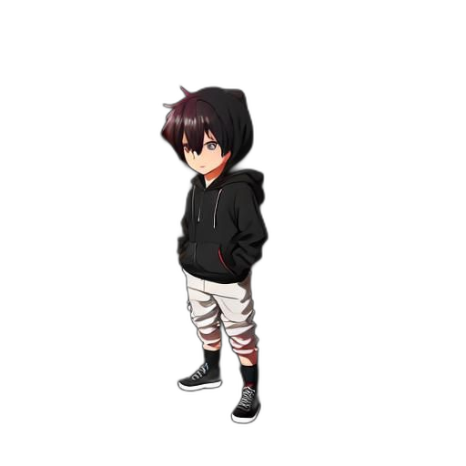

# Hi, I'm Bios Thusvill

<!-- ### Systems & Graphics Programmer | C++ | Vulkan | C# -->

 <!-- I am a CS student and Software Engineer focused on low-level systems, graphics pipelines, and performance-critical applications. I enjoy building tools from scratch, from game engines to macOS system utilities. -->

<!-- --- -->

## My Statics

---

## Specialized Toolkit

  

---

## My Projects

<table border="0">
  <tr>
    <td width="50%" align="center" valign="top">
      
       
      <b>VectorVertex</b> 
      <i>C++ & Vulkan Engine</i>
    </td>
    <td width="50%" align="center" valign="top">
      
       
      <b>LiveWallpaperMacOS</b> 
      <i>Objective-C++ & System APIs</i>
    </td>
    
  </tr>
   
  <tr>
  <td width="50%" align="center" valign="top">
      
       
      <b>GlowPlayer</b> 
      <i>Audio Player</i>
    </td>
    <td width="50%" align="center" valign="top">
      
       
      <b>YTMusic Downloader</b> 
      <i>YTDLP interface for music downloads</i>
    </td>
    </tr>
     
    <tr>
    <td width="50%" align="center" valign="top">
      
       
      <b>DarkMission</b> 
      <i>FPS Game (3yrs development)</i>
    </td></tr>
</table>

---
## Let's Connect
- **LinkedIn:** https://www.linkedin.com/in/bios-thushvill-pansilushakthi-803366272
- **Email:** thusvill@gmail.com
- **Location:** Colombo, Sri Lanka 🇱🇰

